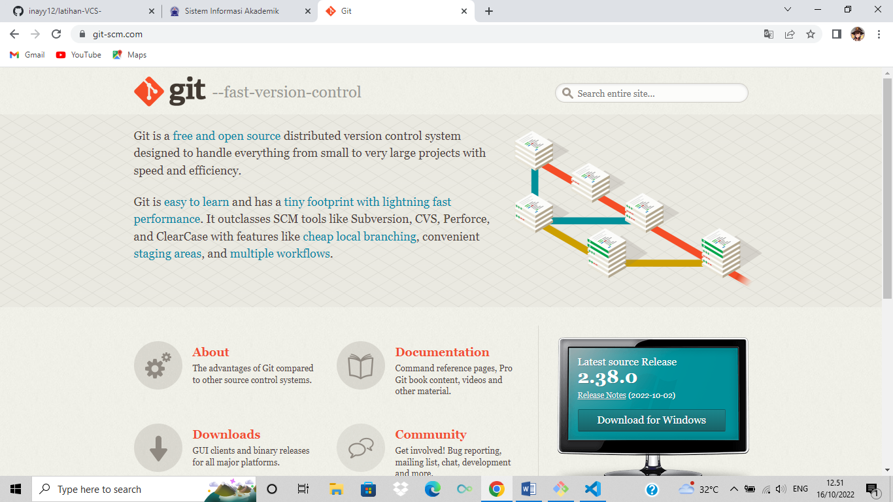
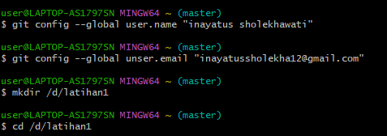
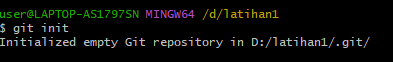
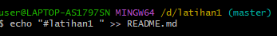
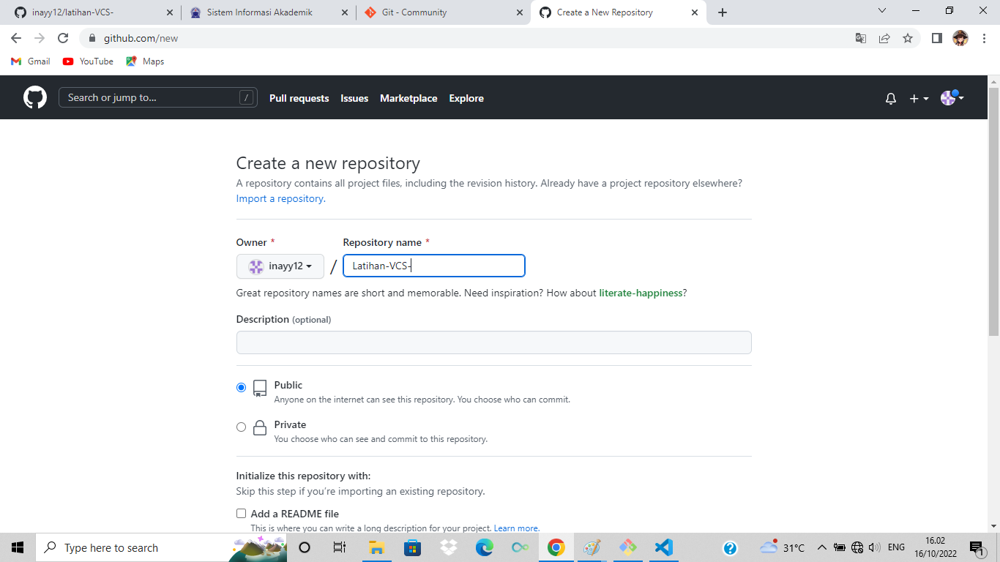

## latihan1 

# Tugas Bahasa Pemrogaman

## Download GIT
membuka website resmi git (git-scm.com), lalu diinstal sesuai leptop yang digunakan


## Membuka GIT bash
setelah itu membuka git bas


## Membuat global coonfig
pada saat pertama kali menggunakan git, kita perlu melakukan konfigurasi unser.name dan unser.email., konfigurasi ini bisa dilakukan untuk global repostiriy atau individual repository atau individual repository. bila belum diakukan konfigurasi,akan mengkibatkan terjadi kegagalan saat menjalankan perintah git commit
Config Global Repository
```
$ git confing --global user.name "nama_user"
$ git confing --global user.email "nama_email"
```

## Membuat Reposiory Local
buka direktory aktif, misal: d:\labs_pemrogaman1 (buka menggunakan windows explorer). klik kanan pada direktory aktif, dan pilih menu GIT BASH, sehingga muncul git bash commad
```
$ mkdir latihan1
$ cd latihan1
```
sehingga terbentuk satu direktori baru dibawahnya, selanjutnya masuk kedalam direktori tersebut dengan perintah cd (change directory)


## Membuat Reposirory local
Jalankan perintah  git init, untuk membuat repository local.
```
$ git init
```
Repository baru berhasil di inisialisasi,dengan terbentuknya suatu direktory hidden dengan nama. git pada direktori tersebut, semua perubahan pada working directory akan disimpan


## Menambahkan File baru pada Repository
untuk membuat file dapat menggunakan text editor, lalu menyimpan filenya pada direktory aktif (repository)
```
$ echo "#latihan 1" >> README.md
```


untuk menambahkan file yang baru saja dibuat gunakan perintah git add
```
$ git add README.md
```
![gambar5]

## Menyimpan Perubahan ke database(Commit)
untuk menyiapkan perubahan yang ada kedalam database repository local, gunakan perintah
```
$ git commit -m "simpan"
```
![gambar6]

## Membuat Repository Sever
Server Reopsitory yang di gunakan http://github.com. ada harus membuat akun terlebih dahulu.pada github, klik tombol strart a project, atau dari menu (icon+) klik new Repository

## Membuat Repository Server
isi nama respositorynya, misal:labpy1. lalu klik tombol Create Repository


## Menambahkan Remote Repository
Repository merupakan server yang digunakan unuk menyimpan perubahan pada local repository seningga dapat diakses oleh banyak user. untuk menabahakan remote remote repository server, gunakan perintah 
```
$git remote add origin https://github.com/abuazzam/labby1.git
```

## Mengirim perubahan ke Server (push)
untuk mengirim perubahan pada local repository ke server gunakan perintah git pus
```
$git pus -u origin master
```
lalu perintah akan meminta memasukan username dan pada akun github.com
![gambar8]

## Melihat hasilnya pada server Repository
buka halaman github.com arahkan pada repositorinya. maka  perubhan akan terlihat pada laman tersebut
![gambar9]

## Clone Repository
clone repository adalah meng-copy repository server dan secara otomatis membuat suatu direoktory sesuai dengan nama respositorynya (working directory). untuk melakukan cloning, mengunakan perintah
```
git clone [url]
```
